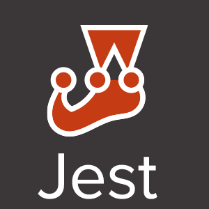

## Bem vindo - Welcome - Bienvenido

### Fullstack Developer - Javascript | Python

This GitHub contains all learning activities developed by *Tiago Berwanger* while studying at [Trybe](https://www.betrybe.com/) :rocket:

Trybe program has more than **1,500 hours** of classroom and online classes and covers front-end, back-end, computer science, software engineering, agile methodologies, and soft skills.

[Trybe Repository](https://github.com/tiagoberwanger/Curso-Trybe)

## Languages

# Portfólio

## Available in deployment

*[Trybeer](https://trybeer-ft.herokuapp.com/)* (React + Tailwind CSS | NodeJS + SQL)  
*[Django Residencial](http://django-residencial.herokuapp.com/)* (Django + BootstrapCSS | Gdrive + PostgreSQL)  
*[Marvel App](https://marvel-app-ft.herokuapp.com/)* (React + BootstrapCSS | NodeJS + JWT + Sequelize + PostgreSQL)  

## Repositories

### Frontend

HTML + CSS + JavaScript  
*[Project - HTML & CSS](https://github.com/tiagoberwanger/Projeto-Lessons-Learned)*  
*[Project - Playground Functions](https://github.com/tiagoberwanger/Projeto-Playground-Functions)*  
*[Project - Meme Generator](https://github.com/tiagoberwanger/Projeto-Meme-Generator)*  
*[Project - Art with Pixels](https://github.com/tiagoberwanger/Projeto-Pixels-Art)*  
*[Project - Task List](https://github.com/tiagoberwanger/Projeto-To-Do-List)*     
*[Project - Facebook home](https://github.com/tiagoberwanger/Projeto-Facebook-Signup)*  
*[Project - JavaScript Unit Tests](https://github.com/tiagoberwanger/Projeto-JS-Unit-Tests)*  
*[Project - Zoo functions](https://github.com/tiagoberwanger/Projeto-Zoo-Functions)*  
*[Project - Shopping Cart](https://github.com/tiagoberwanger/Projeto-shopping-cart)*    

Jest   
*[Project - Asynchronous Jest and Mocking](https://github.com/tiagoberwanger/Projeto-Jest-Assincrono-e-Mocking)*  

React  
*[Project - Movie Cards Library](https://github.com/tiagoberwanger/Projeto-Movie-Card-Library)*  
*[Project - Movie Cards Library Stateful](https://github.com/tiagoberwanger/Projeto-Movie-Card-Library-Stateful)*  
*[Project - Movie Cards Library CRUD](https://github.com/tiagoberwanger/Projeto-Movie-Card-Library-CRUD)*  
*[Project - Frontend Online Store](https://github.com/tiagoberwanger/Projeto-frontend-online-store)*  
*[Project - React Tests](https://github.com/tiagoberwanger/Projeto-React-Tests)*  
*[Project - Table with data filters](https://github.com/tiagoberwanger/Projeto-Trybe-Wallet)*  
*[Project - Trivia Game](https://github.com/tiagoberwanger/Projeto-Trivia-Game)*  
*[Project - Datatable StarWars with Context API and Hooks](https://github.com/tiagoberwanger/Projeto-Datatable-StarWars)*   
*[Project - Recipe App](https://github.com/tiagoberwanger/Projeto-Recipes-App)*   

### Backend  
*[Project - All For One](https://github.com/tiagoberwanger/Projeto-All-For-One)*  
*[Project - Vocabulary Booster](https://github.com/tiagoberwanger/Projeto-Vocabulary-Booster)*  
*[Project - One For All](https://github.com/tiagoberwanger/Projeto-One-For-All)*  
*[Project - Data Flights](https://github.com/tiagoberwanger/Projeto-Data-Flights)*  
*[Project - Commerce](https://github.com/tiagoberwanger/Projeto-Commerce)*  
*[Project - Aggregations](https://github.com/tiagoberwanger/Projeto-Aggregations)*  
*[Project - Crush Manager](https://github.com/tiagoberwanger/Projeto-Crush-Manager)*  
*[Project - Store Manager](https://github.com/tiagoberwanger/Projeto-Store-Manager)*  
*[Project - Cookmaster](https://github.com/tiagoberwanger/Projeto-Cookmaster)*  

Deploy  
*[Project - Stranger Things - Frontend](https://github.com/tiagoberwanger/Project-Stranger-Things-Frontend)*  
*[Project - Stranger Things - Backend](https://github.com/tiagoberwanger/Project-Stranger-Things-Backend)*

FullStack  
*[Trybeer Project](https://github.com/tiagoberwanger/Projeto-Trybeer)*

### Personal Projects  
*[Residencial - Frontend](https://github.com/tiagoberwanger/Residencial_frontend)*  
*[Residencial - Backend](https://github.com/tiagoberwanger/Residencial_backend)*  
*[Practicing SaSS](https://github.com/tiagoberwanger/project-sass)*  
*[Motorcycles App](https://github.com/tiagoberwanger/Motorcycles_App-Frontend)*  
*[AnotaAi - recruitment](https://github.com/tiagoberwanger/test-backend-nodejs)*  
*[Stone - recruitment](https://github.com/tiagoberwanger/Desafio-MarvelApp-Frontend)*  
*[Stone - recruitment](https://github.com/tiagoberwanger/Desafio-MarvelApp-Backend)*  

## Some examples with GIFs :D

### Task List - Using HTML, CSS and JS languages.

### Facebook Sign Up Page - Using CSS styled flexbox and features.

### FrontEnd Online Store - Using React + API request to MercadoLibre API.
(group project / 4 days / using Kanban)

### Trybe Wallet - Using React/Redux Project with API request to Exchange API.

### StarWars Datatable - Using React/Hooks + API request to Starwars planets API.

### FrontEnd Recipes App - Using React/Redux + API request to Recipes API - responsive to smartphones.
(group project / 10 days / Kanban + Sprint Scrum)

### Front/Backend Trybeer - Using React + Tailwind CSS + NodeJS and SQL - responsive to smartphones.
(group project / 10 days / Kanban + Sprint Scrum)

